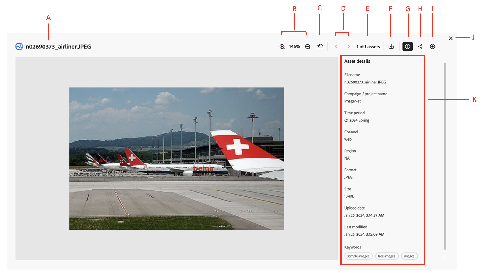

# Properties of an asset {#asset-properties}

[!DNL Content Hub] allows you to view information about the asset which is critical for efficient asset management. It is the collection of all the data available for an asset but it may not necessarily be contained in that asset.

Viewing asset properties help you further categorize assets and is helpful as the amount of digital information grows. It is possible to manage a few hundred files based on just the filenames, thumbnails, and memory. However, this approach is not scalable. It falls short when the number of people involved and the number of managed assets increase. In addition, the value of a digital asset grows, because the asset becomes,

* More accessible - systems and users can find it easily.
* Easier to manage - you can find assets with the same set of properties easier and apply changes to them.
* Complete - asset carries more information and context.

## Evaluate information for the searched assets  {#evaluate-info}

Assets provide you with the right means of creating, managing, and exchanging information for your digital assets.

### View properties of an asset {#properties-ui}

Before you use, share, or download an asset, you can view it more closely. The preview feature lets you view not just the images but a few other supported asset types as well. You can not only view the asset but also view its detailed information and take other actions. To view information of an asset, navigate to the asset or [search](search-assets.md) the asset. Then, click the asset to open its information. The following figure demonstrates the fields available in asset preview screen: 

* **A:** Title of an asset 
* **B:** Proceed to previous or next asset 
* **C:** Preview asset more closely by zooming in or out 
* **D:** Percentage of zoom 
* **E:** Close preview screen 
* **F:** Collapse or preview information of an asset 
* **G:** Download the opened asset 
* **H:** Share the opened asset 
* **I:** Information of an asset which includes title, format, size, resolution, tags, and smart tags. 

## Supported formats {#supported-formats}

Format refers to the composition of an asset. The supported assets can be in image, document, video, printable media, and so on, formats. Following table demonstrates the supported file formats in [!DNL Content Hub]: 

<table>
    <tbody>
     <tr>
      <th><strong>File type</strong></th>
      <th><strong>Supported formats</strong></th>
     </tr>
     <tr>
      <td>Image</td>
      <td>
        <ul>
            <li>[!UICONTROL JPEG]</li> 
            <li>[!UICONTROL PNG]</li> 
            <li>[!UICONTROL SVG]</li>
        </ul>
      </td>
     </tr>
     <tr>
      <td>Video</td>
      <td>
        <ul>
            <li>[!UICONTROL Quicktime]</li>  
            <li>[!UICONTROL MP4]</li> 
        </ul>
      </td>
     </tr>
      <tr>
      <td>Document</td>
      <td>
        <ul>
            <li>[!UICONTROL txt] (Plain)</li>  
            <li>[!UICONTROL Doc/Docx]</li> 
            <li>[!UICONTROL XML]</li>
        </ul>
      </td>
     </tr>
     <tr>
      <td>Printable media</td>
      <td>
        <ul>
            <li>[!UICONTROL PDF]</li>  
        </ul>
      </td>
     </tr>  
    </tbody>
   </table>

### Size {#size-of-an-asset} 

Size demonstrates the logical value of an asset as per its dimensions. It clarifies the space that an asset is taking in DAM. [!DNL Content Hub] support assets up to 2GB. 

### Tags {#tags}

Tags help you categorize assets that can be browsed and searched more efficiently. Tagging helps in propagating the appropriate taxonomy to other users and workflows. 

### Smart Tags{#smart-tags} 

[!DNL Content Hub] uses Adobe Sensei's smart content services to train assets using recognition algorithm on the tags-based structure. This content intelligence is then used to apply relevant tags on a different set of assets. Smart Tags increase the content velocity of your projects by helping that you find relevant assets quickly. The smart tags are an example of asset information that is not contained in the image. [!DNL Content Hub] automatically applies smart tags to assets, by default. 

### Date range {#date-range} 

The date range allows you to select dates you want to see the assets. You can customize date range by choosing the start and end dates. 

