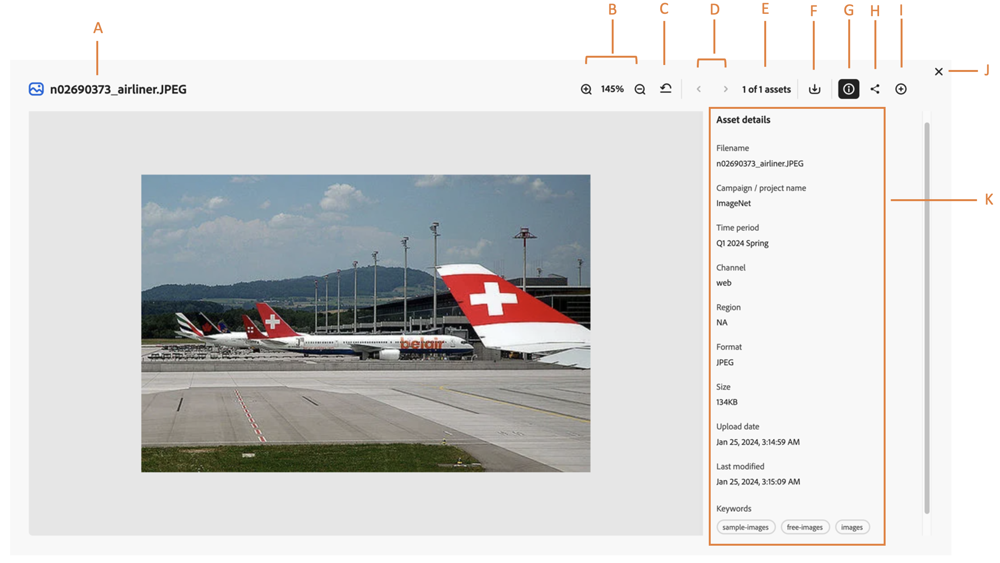

# Properties of an asset {#metadata}

When.

## Evaluate information for the searched assets  {#evaluate-info}

The [!DNL Content Hub] search provides you with the right means of managing and exchanging metadata for your digital assets.  

## View properties of an asset {#properties-ui}

Before you use, share, or download an asset, you can view it more closely. The preview feature lets you view not just the images but a few other supported asset types as well. You can not only view the asset but also view its detailed metadata and take other actions. To view the metadata of an asset, browse to the asset or search the asset > Click the asset to open its metadata. The following figure demonstrates the fields available in asset preview screen: 

* **A:** Title of an asset 
* **B:** Proceed to previous or next asset 
* **C:** Preview asset more closely by zooming in or out 
* **D:** Percentage of zoom 
* **E:** Close preview screen 
* **F:** Collapse or preview metadata information of an asset 
* **G:** Download the opened asset 
* **H:** Share the opened asset 
* **I:** Metadata information of an asset which includes title, format, size, resolution, tags, and smart tags. 

## Supported formats {#supported-formats}

Format refers to the composition of an asset. The supported assets can be in image, document, video, printable media, etc. formats. Following table demonstrates the supported file formats in Content Hub: 

<table>
    <tbody>
     <tr>
      <th><strong>File type</strong></th>
      <th><strong>Supported formats</strong></th>
     </tr>
     <tr>
      <td>Image</td>
      <td>
        <ul>
            <li>[!UICONTROL JPEG]</li> 
            <li>[!UICONTROL PNG]</li> 
            <li>[!UICONTROL SVG]</li>
        </ul>
      </td>
     </tr>
     <tr>
      <td>Video</td>
      <td>
        <ul>
            <li>[!UICONTROL Quicktime]</li>  
            <li>[!UICONTROL MP4]</li> 
        </ul>
      </td>
     </tr>
      <tr>
      <td>Document</td>
      <td>
        <ul>
            <li>[!UICONTROL txt] (Plain)</li>  
            <li>[!UICONTROL Doc/Docx]</li> 
            <li>[!UICONTROL XML]</li>
        </ul>
      </td>
     </tr>
     <tr>
      <td>Printable media</td>
      <td>
        <ul>
            <li>[!UICONTROL PDF]</li>  
        </ul>
      </td>
     </tr>  
    </tbody>
   </table>

### Size {#size-of-an-asset} 

Size demonstrates the logical value of an asset as per its dimensions. It clarifies the space an asset is taking in DAM. Content Hub support assets up to 2GB. 

### Tags {#tags}

Tags help you categorize assets that can be browsed and searched more efficiently. Tagging helps in propagating the appropriate taxonomy to other users and workflows. 

### Smart Tags{#smart-tags} 

Content Hub uses Adobe Sensei's smart content services to train assets using recognition algorithm on the tags-based structure. This content intelligence is then used to apply relevant tags on a different set of assets. Smart Tags increase the content velocity of your projects by helping you find relevant assets quickly. The smart tags are an example of metadata that is not contained in the image. Content Hub automatically applies smart tags to assets, by default. 

### Date range {#date-range} 

The date range allows you to select dates you want to see the assets. You can customize date range by choosing the start and end dates. 

