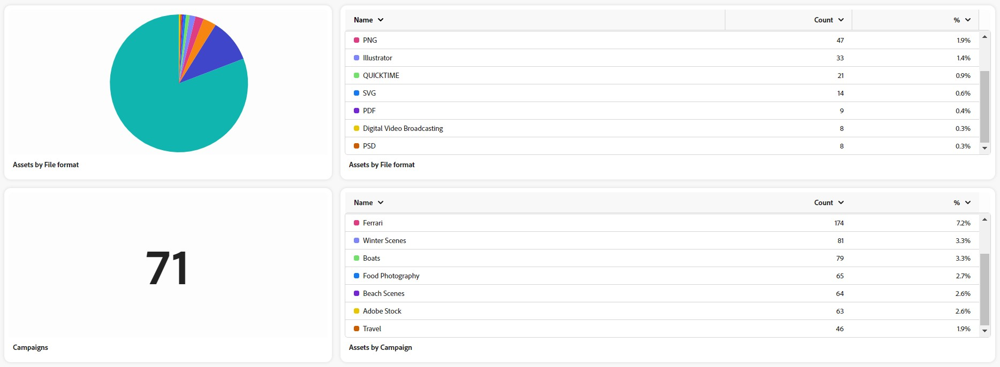

# Assets Insights in [!DNL Content Hub] {#assets-insights}

 

[!DNL Content Hub] provides valuable insights into assets, addressing a common challenge that marketing stakeholders often encounter – user ratings and asset usage statitics used in third-party websites, processes, marketing campaigns, and Adobe's creative solutions. By gaining a clear understanding of the performance and popularity of the assets, it delivers actionable insights essential for enhancing a user experience.

<!-- Assets Insights functionality lets you track user ratings and usage statistics of images that are used in third-party websites, marketing campaigns, and Adobe's creative solutions. It helps provide insights about performance and popularity of the images. -->

## View statistics for uploaded assets

You can effortlessly view statistics of the uploaded assets and collections. You can track the upload history of your assets with the yearly, monthly and daily asset uploads view.
   
   

<!-- You can track the upload history of your assets over the past 30 days or gain a more comprehensive view with data spanning the last 12 months. This feature enables you to evaluate the upload count of assets.  -->

<!-- To view statistics of your uploaded assets, follow the below steps:

1. Go to the **[!UICONTROL [!DNL Insights]]** tab.

2. Select the desired time frame to view the statistics; you can opt for either last 30 days or last 12 months.

Data for the selected time frame is displayed, including the upload count for the specified duration. -->

## View statistics for asset count by [!UICONTROL Asset Type]

Content Hub lets you view statistics of the count of assets based on their file format. 
You can gain valuable insights into asset distribution facilitating informed decision-making and strategic planning.

The table presents a detailed overview of various asset types, including their count and the respective percentage within the repository. You can adjust column sizes and sort assets by asset name, count, and percentage.

The pie chart visually represents the total count of assets, providing a clear illustration of individual asset counts and their corresponding percentages.

You can also view the **[!UICONTROL Assets by Campaign]**, **[!UICONTROL Assets by Channel]** and **[!UICONTROL Assets by Region]** respectively in the [!UICONTROL Insights] page.

 
