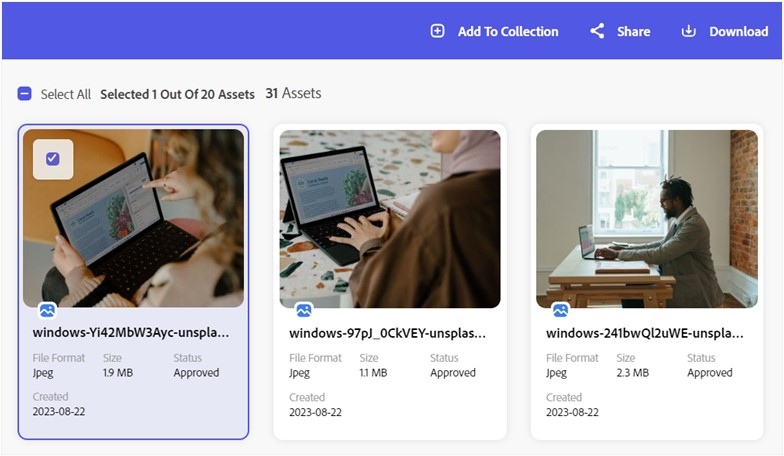

# Download assets from Content Hub {#download-assets}

 

The Content Hub lets you download and share your assets. You can download multiple asset renditions. These assets may include images, videos, or any other digital content. Users can download assets in various file formats, including JPEG, WEBP, and PNG, catering to diverse preferences. The Content Hub enhances accessibility and adaptability for effective asset management and distribution.  

## Download assets

You can download a single assets or multiple assets in different versions from the Content Hub. The version can be the original rendition of the asset and the other renditions including JPEG, WEBP, and PNG.

### Download a single asset 

1. Select the asset you need to download.
 
1. Click **[!UICONTROL Download]**.   Alternatively, you can click the download icon available on the asset card. 
1. Select the rendition (question for Riya- Do we have the option of selecting any particular rendition or is it a selection of original and Original + Renditions?) you want to download, and then click the **[!UICONTROL Download file option]**. 

#### View and download renditions of assets  

You can view and download the JPEG, WEBP, and PNG renditions of the assets available on the Content Hub. To download different renditions of the assets, try the following steps: 

1. Select the asset you need to download. 
1. Click **[!UICONTROL Download]**. 
1. Select the rendition you want to download.   You can download single or multiple renditions as needed. 
 
The asset with the selected rendition(s) is successfully downloaded. 

### Download multiple assets 

To download multiple assets, follow these steps: 

1. Select the assets you need to download. 
 
1. Click **[!UICONTROL Download]**. 
1. Select the version of the asset, and then click **[!UICONTROL Download]**.
 
 
>[!NOTE]
> 
>When downloading multiple assets, you can download either the original version or both the original and rendition versions. Selecting a specific rendition for download is not available. 
