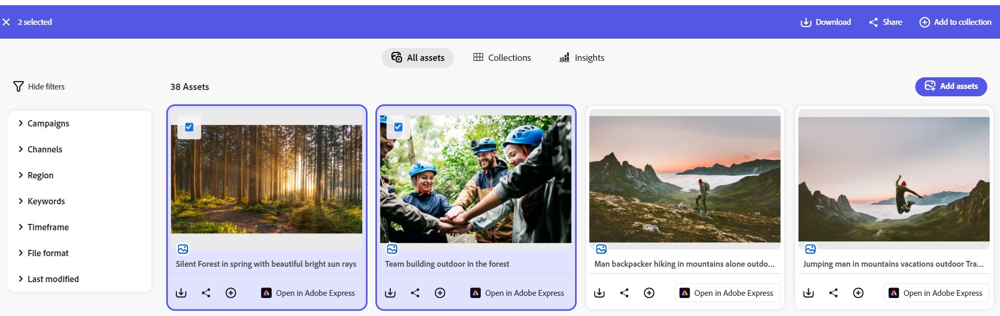
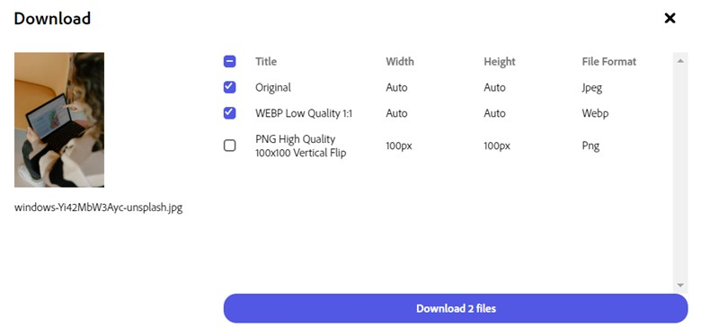
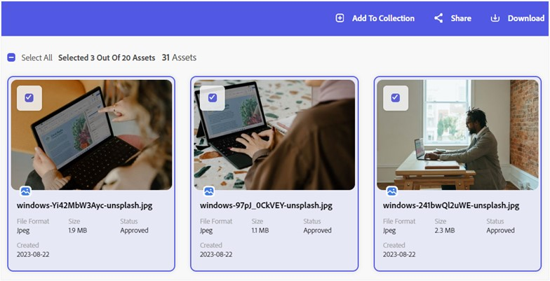
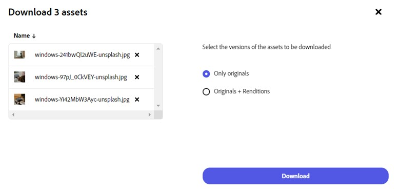

# Download assets from the content module of Adobe GenStudio {#download-assets}

<!--  -->

The content module of Adobe GenStudio lets you download and share your assets. You can also download multiple asset renditions. These assets may include images, videos, or any other digital content. Users can download assets in various file formats catering to diverse preferences. The content module of Adobe GenStudio enhances accessibility and adaptability for effective asset management and distribution.  

You can download single asset or multiple assets in different versions using the content module of Adobe GenStudio. The versions can include the originals and other renditions of the original asset.

## Download asset {#download-single-asset} 

1. Select the asset(s) you need to download.
 
1. Click **[!UICONTROL Download]**.   Alternatively, you can click the download icon available on the asset card.
The assets is downloaded in its original form or file type.

<!-- Select the rendition you need to download. You can either select the original asset or the **[!UICONTROL Originals + Renditions]** option, and then click **[!UICONTROL Download]**.  -->

<!-- ## View and download renditions of an asset {#view-download-renditions} 

You can view and download the renditions of an asset available on the content module of Adobe GenStudio. To download different renditions of the assets, execute the following steps: 

1. Click the download icon available on the asset card. The icon is visible only when you do not select the asset.
1. Click **[!UICONTROL Download]**. 
1. Select the rendition you need to download.   You can download single or multiple renditions, as per your requirements. 
 

1. Click **[!UICONTROL Download]**.  -->

<!-- 
## Download multiple assets {#download-multiple-assets} 

To download multiple assets, follow these steps: 

1. Select the assets you need to download. 
 
1. Click **[!UICONTROL Download]**. 
1. You can either select **[!UICONTROL Only Originals]** or the **[!UICONTROL Originals + Renditions]** option, and then click **[!UICONTROL Download]**. 
  -->