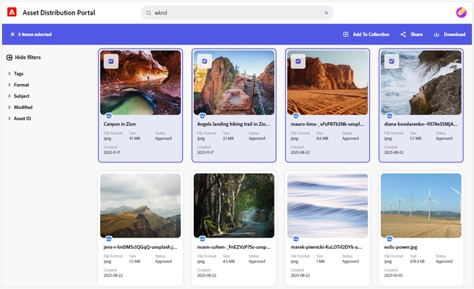
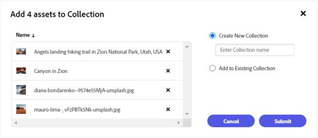
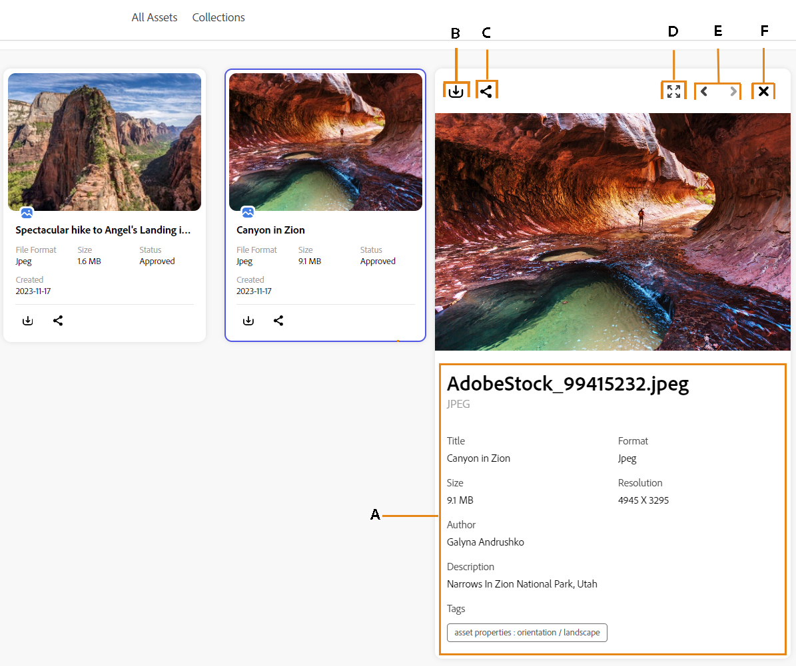
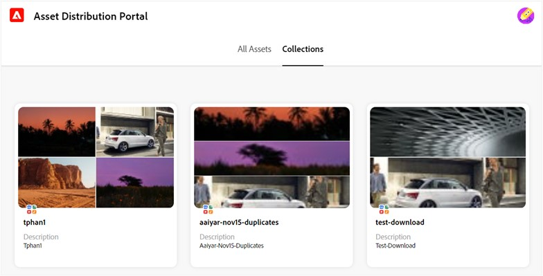
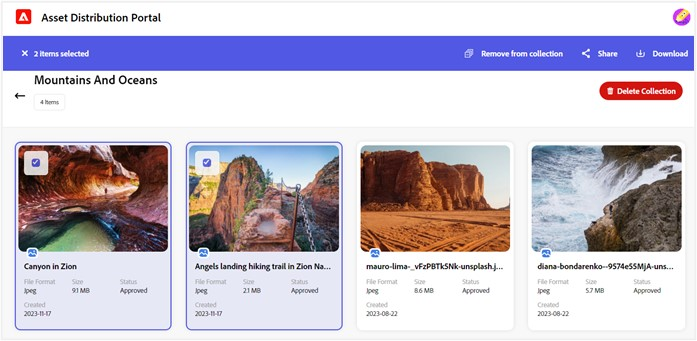

# Manage collections in Content Hub {#manage-collections}

A collection in [!UICONTROL Adobe Experience Manager Assets] is a set of assets that can be shared among users. These collections can be static or dynamic.

[!UICONTROL Content Hub] lets you create public collections. These public collections are accessible to all the entitled users, creating a shared space where multiple users can efficiently access and utilize the content. Collections promote collaborative use of resources for increased efficiency and convenience. Within the collection browse page, users can: 

* **Create**: Create one or more collections in Content Hub. 
* **View**: View the assets and their properties in the collection.  
* **Share**: Share the assets as a link with others. 
* **Download**: Download the assets in different renditions. 
* **Remove**: Remove specific assets from a collection. 
* **Delete**: Delete an entire collection. 

It helps users to easily access and manage the diverse assets available on the Contwnt Hub. 

## Create collections

You can create a new collection or add assets to an existing collection in the Content Hub.

### Create a new collection 

Select the assets you want to add in a collection, and click **[!UICONTROL Add To Collection]**.

  Enter the collection name in the **[!UICONTROL Create New Collection]** field and click **[!UICONTROL Submit]**.

### Add to existing collection 

Select the assets you want to add to the existing collection, and click **[!UICONTROL Add To Collection]**.

Click the **[!UICONTROL Add to Existing Collection]** option.  Select the collection to which you need to add the assets. and click **[!UICONTROL Submit]**.

## View collections 

Navigate to the Collections tab. To view the list of assets available in a collection, click the collection name.

Click the asset you need to view within a collection. [!UICONTROL Adobe Content Hub] displays the detailed view for the asset. 

**A**: Details and metadata of the asset, **B**: Download the asset, **C**: Share the asset as a link, **D**: View the asset in the full screen, **E**: View the previous or next asset, **F**: Close preview screen 

## Share collections 

Click the collection you need to share. 
  Select the assets you need to share, and select the link expiration duration. 
  Click **Copy share link**. Learn more about sharing assets in the Content Hub. 

## Download collections 

To download assets in a collection, navigate to the Collections tab.   

Open the collection containing the assets you need to download. Select the assets and click **[!UICONTROL Download]**. 
Learn how to download an asset from the Content Hub. 

## Remove assets from a collection 

You can remove single or multiple assets from a collection. To remove assets from a collection, open the collection where you need to remove assets. 
  Select the assets and click **Remove from collection**. 

 

 
You are prompted to confirm the asset removal. Click **[!UICONTROL Proceed]**.  
The selected assets are successfully removed from the collection. 

## Delete collections 

To delete a collection, navigate to the Collections tab and click the collection name that you need to delete.
Click **[!UICONTROL Delete Collection]**.
 