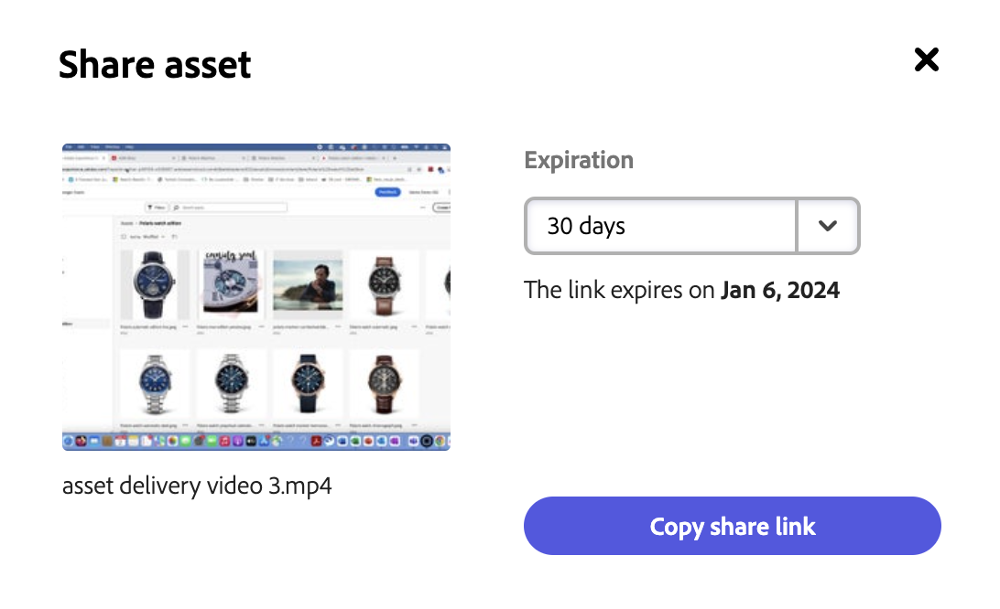
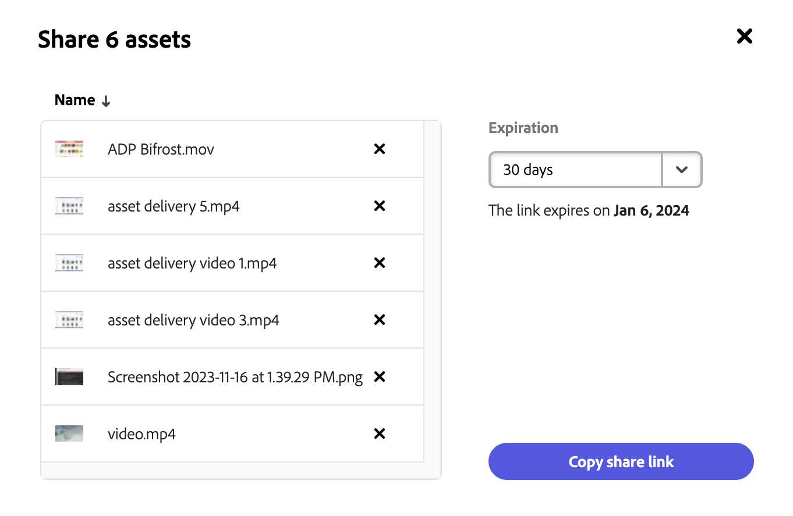
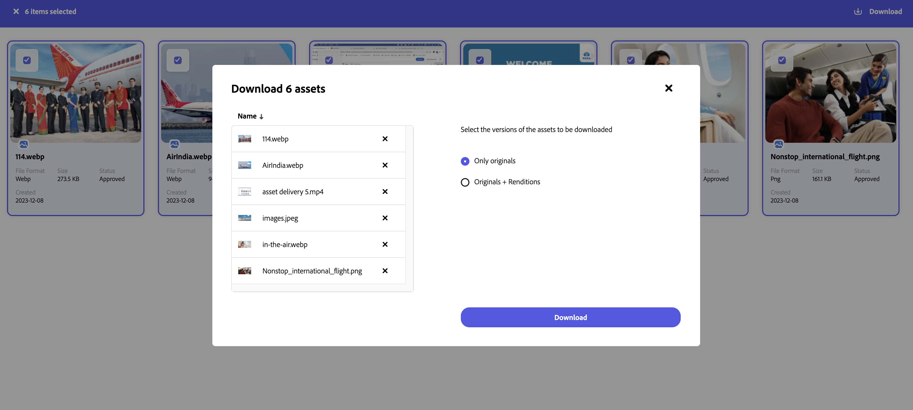

# Search Assets as a link

Sharing assets through a link is a convenient way of making the resources available to the [!DNL Content Hub] users. The functionality allows authorized users to access and download the assets shared with them. When downloading assets from a shared link, [!DNL Content Hub] uses an asynchronous service that offers faster and uninterrupted download.

## Share a single asset {#share-a-single-asset}

You can share a single asset by executing the following steps: 

1. Select an asset and click the  icon to share an asset. 

    

1. Use the **[!UICONTROL Expiration]** field to specify an expiration date for the link. Select one of the available options, such as, 24 hours, 1 week, 30 days, 90 days, 1 year or specify a custom date.  

1. Click **[!UICONTROL Copy share link]**. You can then share the copied link with the recipient.
 
## Share multiple assets {#share-multiple-assets}

[!DNL Content Hub] allows you to share multiple assets via a shared link. Execute the steps below: 

1. Select assets that you want to share with the authorized recipient. You can select multiple assets one by one or click select all to select all available assets at once. 

1. Click the  icon. 

    

1. In preview section, select or delete assets as per the requirement. Use the **[!UICONTROL Expiration]** field to specify an expiration date for the link. Select one of the available options, such as, 24 hours, 1 week, 30 days, 90 days, 1 year or specify a custom date.  

1. Click **[!UICONTROL Copy share link]**. You can then share the copied link with the recipient. 

## View and manage shared links {#view-and-manage-shared-links}

You can select one or multiple assets and preview the selected assets before sharing them to the authorized users. 

### Preview assets {#preview-assets}

You can preview to see how a digital asset that you are going to share looks when it is viewed by a customer into their portal. By default, the embedded viewer can be used to preview an asset. A viewer is a collection of various settings or presets, such as the viewer display size, zoom behavior, previous, next, etc. These presets determine how users view rich-media assets on their computer screens and mobile devices. 

You can preview a selected asset by executing the following steps: 

1. Select an asset. Double click an asset to open a preview section of the selected asset displaying metadata associated to it. You can maximize, go to the previous or next asset, or download the asset directly from the preview panel. 

1. Before sharing an asset, you can preview the selected asset. Select an asset. The next pop-up shows the preview panel on the left. 

### Access the shared assets {#access-shared-assets}

After sharing the link for assets, the recipients can click the link to preview or download the shared assets in a web browser without the need to log in to [!DNL Content Hub]. 

Click the link, and then click the asset to preview it. You can select to view the shared assets in a Card View. You can hover the mouse over the shared asset to either select the asset or download it.  

You can also select multiple assets and click Download icon. You can choose to download versions of the shared asset. Download original assets or original+renditions of an asset. [!DNL Content Hub] downloads each asset one by one.

