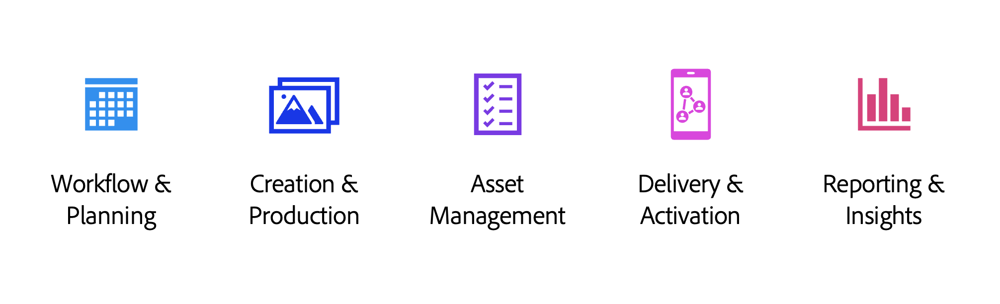

# Introduction to GenStudio

GenStudio is a standalone enterprise product that embodies Adobe's Content Supply Chain to streamline marketing campaigns. It is challenging to build personalized, brand-approved content at scale, monitor effectiveness, and adapt quickly to the ever-changing market. GenStudio brings Creative Cloud and Experience Cloud together in one application that leverages generative AI as a performance multiplier for enterprise marketing teams.

With GenStudio you can:

- Create on-brand content using natural language prompts
- Generate variants to personalize across channels or freshen an ongoing campaign
- Evaluate content performance with insights about campaigns and content attributes

## Generative AI technology

GenStudio harnesses the power of generative AI to accelerate the content creation process and ensure high-quality content generation. The iterative lifecycle of your creative assets results in increasingly accurate and brand-aligned content that resonates with your target audience.

Begin by effectively training GenStudio on your organization's branding, customer personas, and product descriptions through the powerful brand guidelines feature. See the [Brand references overview](../user-guide/references/overview.md) to learn how to prepare and upload these guidelines.

## GenStudio Content lifecycle

GenStudio simplifies the content supply chain workflow and allows marketers to do the following in one application:

- set up brand guidelines and campaigns
- create brand-aligned content and experiences for all channels
- activate seamlessly with Adobe and non-Adobe applications and platforms
- measure campaign performance
- derive insights for performance optimization
- find and reuse approved content
- generate new content

## Adobe tools

The following Adobe tools make up the GenStudio feature matrix:

|                | Functionality |
| -------------- | ------------- |
| **AEM Assets Content Hub** | Find and reuse approved content. |
| **Customer Journey Analytics** | View insights into Content performance. |
| **Express with Firefly**  | Directly create variants and edit content.  |
| **Workfront**  | Review and approve content. |

## Terminology

