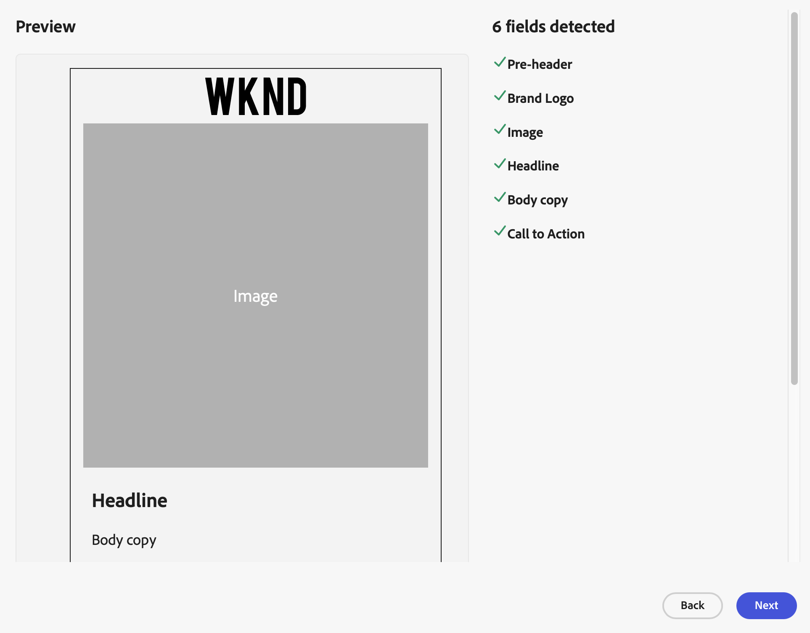

# Customize a template

Adapt your HTML templates for Adobe GenStudio for Performance Marketers by using the _Handlebars_ templating language. The [!DNL Handlebars] syntax uses regular text with double braces as content placeholders. See [`What is [!DNL Handlebars]?`](https://handlebarsjs.com/guide/#what-is-handlebars) in the _Handlebars language guide_ to learn how to prepare your template.

The next few sections explain how to add content placeholders, hide unnecessary elements from preview, and manage links to static content. Once your template is ready, you can [upload it to GenStudio for Performance Marketers](use-templates.md#upload-a-template) and start generating personalized emails based on your custom template.

## Content placeholders

GenStudio for Performance Marketers recognizes certain [elements](use-templates.md#template-elements) within a template, but only if you identify them with a recognized field name.

Within the head or body of a template, you can use the [!DNL Handlebars] syntax as a content placeholder where you require GenStudio for Performance Marketers to populate the template with actual content. GenStudio for Performance Marketers recognizes and interprets the content placeholders based on the [recognized _field_ name](#recognized-field-names).

For example, you can use `{{ headline }}` with the [!DNL Handlebars] syntax to indicate where the headline of the email should be placed:

```handlebars
<div>{{headline}}</div>
```

### Recognized field names

The following table lists the field names recognized by GenStudio for Performance Marketers for population into templates. Add these field names using the [!DNL Handlebars] syntax to your template where you need GenStudio for Performance Marketers to generate content.

| Field          | Role                   | Channel template               |
| -------------- | ---------------------- | ------------------------------ |
| `pre_header`   | Pre header             | email             |
| `headline`     | Headline               | email  <br>Meta ad |
| `body`         | Body copy              | email  <br>Meta ad |
| `cta`          | Call to action         | email  <br>Meta ad |
| `on_image_text`| On image text          | Meta ad            |
| `image`        | Image                  | email  <br>Meta ad   |
| `brand_logo`   | Logo of selected brand<br>See [Brand logo field name](#brand-logo-field-name) for recommended usage. | email<br>Meta ad |

GenStudio for Performance Marketers populates certain fields automatically in the following templates:

- **Email template** does not require you to identify the `subject` field
- **Meta Ads template** does not require you to identify the `headline`, `body`, and `CTA` fields

<!--
- **Display Ads template** does not require you to idenitify the `CTA` field
-->

>[!WARNING]
>
>For Instagram ads, the generated headline does not appear in the final experience.

There is a limit of 20 fields when uploading a template to GenStudio for Performance Marketers. Since the `subject` field is automatically generated in an email, it counts as one field. This means that there are 19 fields allowed in an email template.

>[!TIP]
>
>You can verify your template using the [template preview](#template-preview) in GenStudio for Performance Marketers.

#### Brand logo field name

At this time, you cannot select the brand logo for the template upload. The following examples demonstrate two methods that conditionally render the brand logo. Each method verifies the source, provides a default or alternative image in case the brand logo is not available, and applies a style:

**Example 1**: Using [!DNL Handlebars] Built-in Helpers condition directly in the HTML `img src` attribute:

```html
{{/if}}" alt="img alt text" style="max-width: 88px; margin: 10px auto; display: block;">
```

**Example 2**: Using [!DNL Handlebars] Built-in condition statement to wrap the HTML `img` tag:

```handlebars
{{#if brand_logo}}
    
    {{else}}
    
{{/if}}
```

#### Manual field names

All other field names are treated as manually populated fields.

To create an editable section, add double brackets around the section name:

```handlebars
{{customVariable}}
```

### Sections or groups

_Sections_ inform GenStudio for Performance Marketers that the fields in this section require a high degree of coherence. Establishing this relationship helps the AI to generate content that matches the creative elements in the section.

Use a prefix of your choice in the field name to indicate that a field is part of a section or group. For example, you may want to spotlight content that appears in a highlighted area:

- `pod1_headline`
- `pod1_body`

Each section can use only one of each field type. In the above example, the `pod1` section can only use one `pod1_headline` field.

A template can include up to three sections:

- `headline`
- `body`
- `pod1_headline`
- `pod1_body`
- `pod2_headline`
- `pod2_body`

GenStudio for Performance Marketers understands that `pod1_headline` is more closely related to `pod1_body` than to `pod2_body`

## Template preview

When you [upload a template](use-templates.md#upload-a-template), GenStudio for Performance Marketers scans the HTML file for recognized fields. Use the preview to review your [template elements](use-templates.md#template-elements) and confirm that you identified them properly with the [recognized field names](#recognized-field-names).

Example Preview for an email template:

{width="650"}

### Control preview

You can control the visibility of special content by using Built-in Helpers (special expressions in the [!DNL Handlebars] template language that perform certain actions). For example, you can add a conditional statement that adds tracking parameters to links in the exported template while keeping the preview links clean.

The `_genStudio.browser` value is set when rendering a template, and the `genStudio.export` value is set when exporting a template. You may decide to include certain content at the top of an email using a conditional wrapper, for example, when the template is used for export:

```handlebars
{{#if _genStudio.export}}
<%@ include view='emailParent' %>
{{/if}}
```

Another example may be to prevent the use of tracking codes when previewing a template in GenStudio for Performance Marketers. The following example shows how to add tracking parameters to links in the exported template, while keeping the preview links clean:

```handlebars
<a class="button" {{#if _genStudio.browser }}
   href="{{ link }}"{{/if}}{{#if _genStudio.export }}
   href="{{ link }}?trackingid=<%=getTrackingId()%>&mv=email"{{/if}}
   target="_blank">{{ cta }}</a>
```

## Static content

Email and Meta templates often link to images and CSS files hosted outside GenStudio for Performance Marketers. When GenStudio for Performance Marketers generates thumbnails for these templates or the experiences derived from them, it may ignore these external resources if they do not have the correct Cross-Origin Resource Sharing (CORS) headers.

To ensure that these resources are available during the thumbnail generation process, consider two options:

1. **Use CORS headers**: The host server must send responses with an `Access-Control-Allow-Origin` header set to `https://experience.adobe.com` value for production environments. This method allows GenStudio for Performance Marketers to access and include the resources.

1. **Use Data URLs**: Embed the external resources directly into the template using Data URLs. This method bypasses CORS restrictions and ensures that the resources are available during thumbnail generation.

## Template examples

+++Example: Email template with one section

The following is a basic example of an HTML template for an email that contains one section. The head contains simple, inline CSS for styling. The body contains a `pre-header`, `headline`, and `image` [placeholder](#content-placeholders) for use by GenStudio for Performance Marketers to inject content during the email generation process.

```handlebars {line-numbers="true" highlight="13"}
<!DOCTYPE html>
<html>
<head>
    <title>Adobe</title>
    <style>
        .container {
            width: 100%;
            padding: 20px;
            font-family: Arial, sans-serif;
        }
    </style>
</head>
<body>{{ pre_header }}
    <div class="container">
        <h1>{{ headline }}</h1>
        <p></p>
        <p>{{ body }}</p>
    </div>
</body>
</html>
```

+++

+++Example: Email template with multiple sections

The following is the same HTML template in the example above, but with two more sections. The head contains inline CSS for styling a group. The body uses two groups with [content placeholders](#content-placeholders) using a prefix.

```handlebars {line-numbers="true" highlight="33"}
<!DOCTYPE html>
<html>
<head>
    <title>Adobe</title>
    <style>
        .container {
            width: 100%;
            padding: 20px;
            font-family: Arial, sans-serif;
        }
        .pod {
            background-color: #f8f8f8;
            margin: 10px;
            padding: 20px;
            border-radius: 5px;
        }
        .pod h2 {
            color: #333;
        }
        .pod p {
            color: #666;
        }
    </style>
</head>
<body>{{ pre_header }}
    <div class="container">
        <h1>{{ headline }}</h1>
        <p></p>
        <p>{{ body }}</p>
    <!-- Pod1 -->
        <div class="pod">
            <h2>{{ pod1_header }}</h2>
            <p>{{ pod1_body }}</p>
        </div>
        <!-- End of Pod1 -->
    <!-- Pod2 -->
        <div class="pod">
            <h2>{{ pod2_header }}</h2>
            <p>{{ pod2_body }}</p>
        </div>
        <!-- End of Pod2 -->
    </div>
</body>
</html>
```

+++

+++Example: Meta ad template

The following is a basic example of a Meta ad template. The head contains inline CSS for styling. The body uses [content placeholders](#content-placeholders) using a prefix.

```handlebars {line-numbers="true" highlight="33"}
<!DOCTYPE html>
<html>
<head>
    <meta charset="UTF-8">
    <meta name="viewport" content="width=device-width, initial-scale=1.0">
    <title>Adobe</title>
    <style>
        .ad-container {
            width: 300px;
            border: 1px solid #ddd;
            padding: 16px;
            font-family: Arial, sans-serif;
        }
        .ad-image {
            width: 100%;
            height: auto;
        }
        .ad-headline {
            font-size: 18px;
            font-weight: bold;
            margin: 12px 0;
        }
        .ad-body {
            font-size: 14px;
            margin: 12px 0;
        }
        .ad-cta {
            display: inline-block;
            padding: 10px 20px;
            background-color: #007bff;
            color: #fff;
            text-decoration: none;
            border-radius: 4px;
            text-align: center;
        }
    </style>
</head>
<body>
<div class="ad-container">
    
    <div class="ad-headline">"{{ headline }}"</div>
    <div class="ad-body">"{{ body }}"</div>
    <a href="(https://example.com)" class="ad-cta">"{{ CTA }}"</a>
</div>
</body>
</html>
```

+++
