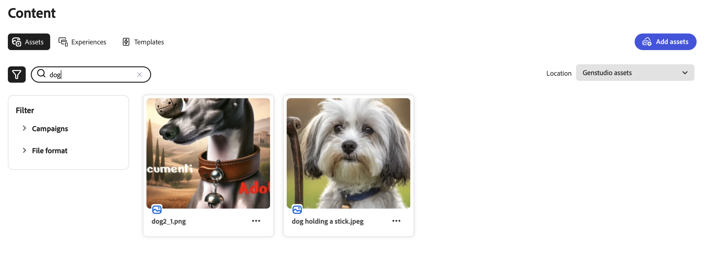

# Manage assets and experiences

Adobe GenStudio for Performance Marketers [!DNL Content] simplifies and enhances the management of brand-approved assets for use and reuse in your digital marketing journey.

## Asset gallery

The [!UICONTROL Assets] gallery shows an inventory of approved assets. The filter (funnel) icon above the left side of the table opens the **[!UICONTROL Filter]** menu where you can select from many categories to filter the assets shown in the gallery. Click the search (magnifying glass) icon to use a keyword to find an asset.

The following shows a search on the term `dog` in the [!UICONTROL Assets] gallery:

### Asset location

By default, assets that you add to [!DNL Content] through the [!DNL Create] process or through upload are stored in the `GenStudio assets` repository. The `GenStudio assets` repository is a read-write repository in GenStudio for Performance Marketers. This means that you can save, edit, and delete assets in the `GenStudio assets` repository.

The **[!UICONTROL Location]** list above the gallery on the right side allows you to select from connected Adobe Experience Manager (AEM) Content Hub repositories. When you select an AEM repository, the gallery shows an inventory of assets from that repository, allowing you to leverage approved assets from these repositories as inputs for content creation. The filter options change to reflect the categories configured in Content Hub.

The AEM repository is read-only, which means you cannot save drafts, new assets, or metadata to the AEM repository. All drafts and final updates for assets, experiences, and templates save to the `GenStudio assets` repository with new [system metadata](asset-details.md#system-metadata).

See [Connect an AEM repository](connect-aem-repo.md) for guidance on adding your AEM Content Hub repository to GenStudio for Performance Marketers.

## Asset management

In [!UICONTROL Content], Performance Marketers can easily store, retrieve, and manage their digital assets. By leveraging both the `GenStudio assets` repository and AEM repositories, users can ensure that their assets are well-organized and accessible for various marketing campaigns. This multi-repository approach provides flexibility and control over asset usage across environments, ensuring that only approved and up-to-date assets are used in marketing efforts.

### Add assets

When adding assets to [!DNL Content], they are by default stored in the `GenStudio assets` repository. The _[!UICONTROL Add assets]_ button is available only when the _[!UICONTROL Location]_ is the `GenStudio assets` repository.

{width="350" align="center"}

**To add one or more assets**:

1. In _[!DNL Content]_, click **[!UICONTROL Add assets]**.

1. In the _Add your approved assets_ view, drop a file or files in the drop space. Optionally, you can select from local files using **[!UICONTROL Browse]** or import files from Dropbox or Microsoft OneDrive.

1. In the _Add details_ section, select a **[!UICONTROL Campaign name]** or enter a new name.

1. To improve discoverability, add optional details such as _Brand name_, _Personas_, _Region_ and _Keywords_ in the **More details** section.

   The more details that you provide, the more you experience the robust capabilities of GenStudio for Performance Marketers. Select one or more details from the list, or enter a new one where applicable, such as with keywords. Each detail you add appears below the list. Click **`x`** to remove a detail.

   Any details you add apply to all the assets added in this action.

   See [Metadata details](/help/user-guide/content/asset-details.md#system-metadata).

1. Click **[!UICONTROL Add assets]**.
1. When the asset upload is completed, click **Done**.
1. To view your new uploaded assets, click **[!UICONTROL Refresh]** from the _New assets available_ notification at the bottom of the Canvas.

<!-- 
In the future, need guidance on template upload errors. For now, the UI just says error.
-->

### Search assets

The [!DNL Content] search interface is quick and responsive, and provides a productive search-first experience.

Apply filters and use metadata tags from asset details to narrow search results. For example, you may want to find an asset of a particular file type or subject matter to help you build a new experience for your campaign.

**To search for content to reuse**:

1. In _[!DNL Content]_, select the **[!UICONTROL Assets]** section.

1. Select an asset repository from the **[!UICONTROL Location]** list, or verify that you are looking at the correct asset repository. `GenStudio assets` is the default repository.

   >[!IMPORTANT]
   >
   >The _Location_ list is available only when you [connect to an AEM repository](connect-aem-repo.md).

1. Click **[!UICONTROL Search]** (magnifying glass) to enter a keyword or description.

1. Narrow your search by selecting a category from the _[!UICONTROL Filter]_ list. For example, if you are looking for a PNG file, click **[!UICONTROL File format]** and choose **PNG**.

   The more you narrow your search, the fewer filter options available. Click **[!UICONTROL Clear all]** to remove all filters.

1. Select an asset for a full view and a list of details.

   Click **[!UICONTROL Download]** (down arrow) to use the asset in your local workstation.
