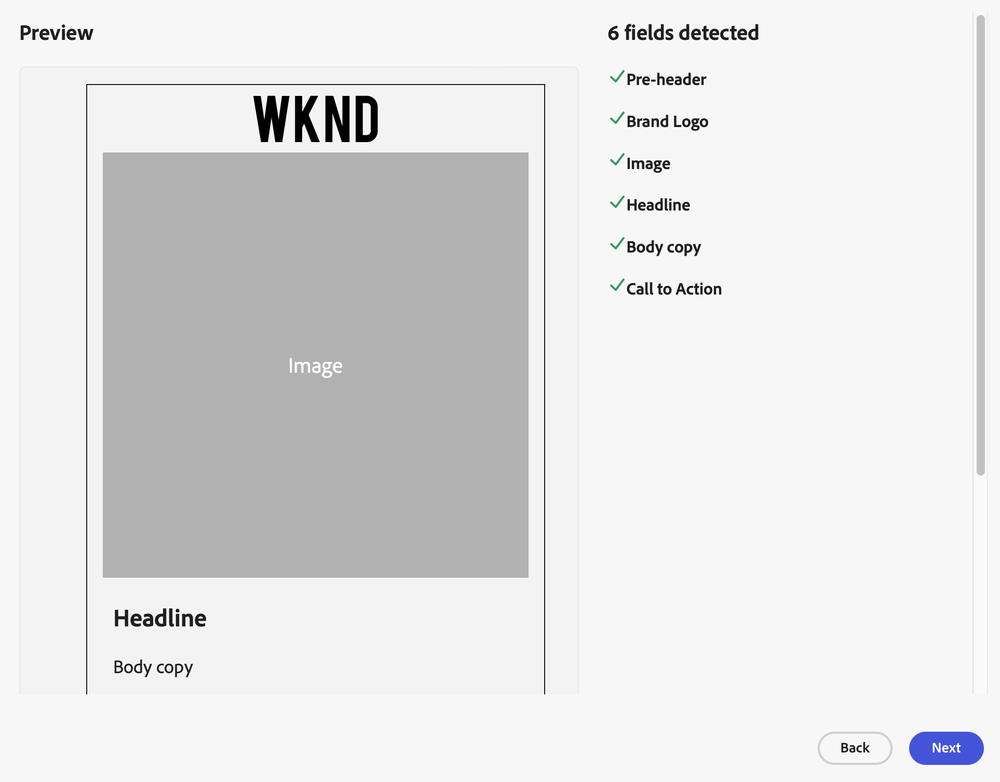

# Work with Templates

GenStudio for Performance Marketers enables content creators to produce consistent on-brand marketing content quickly using _templates_. A template significantly reduces the time and effort required to generate new content by providing a starting point that includes pre-configured layouts and design elements.

## Template elements

A template is a set of instructions defined with HTML and inline CSS that can be used to produce an Email or Meta ad experience.

The following is a list of elements that are used in templates and some details about their characteristics.

- **Preheader**

  - Acts as a secondary subject line in an email, enhancing the main subject line
  - Between 40-50 characters
  - Visible in the inbox alongside the subject before the email is opened
  - Used in email templates

- **Header**

  - Top section of the email that the recipient sees when opening the email
  - Sets the tone and provides context for the included content
  - Used in email templates

- **Headline**

  - First content the recipient sees
  - Should be compelling to catch interest
  - Used in Meta ad templates

- **Body**

  - Main content area where the primary message is conveyed
  - Capable of including text, images, and other media
  - Used in email and Meta ad templates

- **CTA (Call-to-Action)**

  - Encourages the recipient to take a specific action such as clicking a link or making a purchase
  - Used in email and Meta ad templates

- **Images**

  - Enhances visual appeal
  - Break up text
  - Support the message
  - Should be high-quality and eye-catching
  - Used in email and Meta ad templates

- **Footer**

  - Bottom section that contains additional content such as contact details, social media links, disclaimers, and unsubscribe options
  - Used in email templates

- **Text Overlay**

  - Text on an image
  - Use to support and enhance the headline and body
  - Used in Meta ad templates

>[!TIP]
>
>See the [recognized field names](customize-template.md#recognized-field-names) that GenStudio for Performance Marketers supports for templates of each Channel type.

## Configure channel guidelines

It is a best practice to configure [channel guidelines](../guidelines/brands.md#channel-guidelines) for each brand before using templates in GenStudio for Performance Marketers. The channel guidelines directly influence the type of content generated when using the template. For example, you can set character limits on the body of an email.

## Customize template

You [customize your template](customize-template.md) for use in GenStudio for Performance Marketers by inserting content placeholders, or fields, that the generative AI uses to insert content. GenStudio for Performance Marketers recognizes certain fields, such as the `body` field, and adheres to the channel guidelines configured for the selected brand.

>[!TIP]
>
>Follow [accessibility guidelines for building templates](accessibility-for-templates.md) so that you can reach more of your audience and provide an optimal experience.

## Upload a template

Use [Customize templates](customize-template.md) as a guide when preparing a template for GenStudio for Performance Marketers. See [accessibility guidelines for templates](accessibility-for-templates.md) for guidance on providing a better experience for all audiences.

**To add a template**:

1. In _[!DNL Content]_, select the **[!UICONTROL Templates]** section.

1. Click **[!UICONTROL Add template]**.

1. In the _[!UICONTROL Add your approved template]_ pane, browse for the HTML template file or drag the HTML template file to the drop space. Click **[!UICONTROL Next]**.

1. In the _[!UICONTROL Review discovered fields]_ pane, review the detected fields. Verify that you are using the correct template and that all the details are as expected. Click **[!UICONTROL Next]**.

   Example Preview for an email template:

   

   >[!TIP]
   >
   >If the template is not correct, click **[!UICONTROL Back]** and return to the previous step. Upload the corrected template file.

1. In the _[!UICONTROL Provide template details and upload]_ pane, name your template and select a **[!UICONTROL Channel]** type.

   Template name and channel type are required. Additional requirements may include:

   - **Meta**: requires Aspect ratio
   <!-- - **Display ads**: requires Dimensions -->

1. Add as many details as you can to improve template identification in searches and filtering.

1. Click **[!UICONTROL Done]**.

## Create with a template

Find and use an existing template in GenStudio for Performance Marketers to create more experiences.

**To create an experience with a template**:

1. In _[!DNL Content]_, select the **[!UICONTROL Templates]** section.

   {width="650" zoomable="yes"}

1. Select a template for a full view and a list of details.

1. Click **[!UICONTROL Create Experience]** (paintbrush) from the upper right corner to use the template.

1. Continue with [tutorials](/help/tutorials/tutorials.md) to create an experience.
