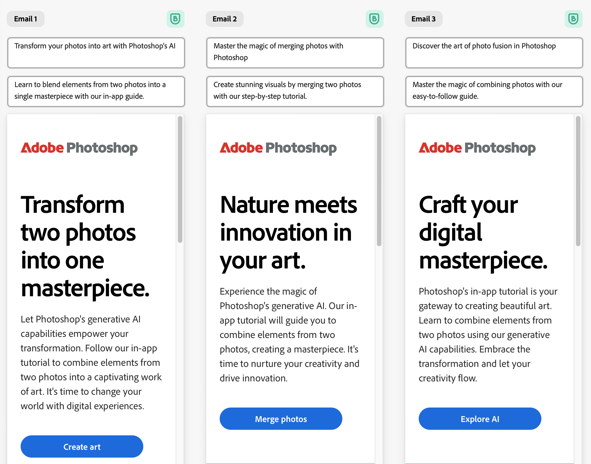

# Write effective prompts

Communicating with the generative AI is essential to working effectively in GenStudio.

GenStudio provides a generative AI prompt each time there is an opportunity to create or modify an asset. The components of an effective prompt should include descriptive language, examples, and information not provided through your configured guidelines.

As a best practice, supply GenStudio with your brand information using [Brand references](./references/overview.md), then you can fully leverage the generative AI to produce brand-aligned content.

## Descriptive language

You can use natural language to articulate your ideas to create new experiences. Your prompt guides the AI to generate channel content that is personalized and images that complement your vision. The more details that you provide, the greater the chance of producing an image or an experience that meets your needs. Use clear and descriptive language to provide as much detail as possible:

- For **images**, use words that describe ambiance, mood, color, composition, and style.
- For **copy**, use words that describe the audience, purpose, new feature descriptions, examples, and actions.

The following is a sample prompt that articulates information about your intent, target audience, and style.

```terminal
Write an email to motivate infrequent users of Photoshop to follow an in-app tutorial that teaches them to combine elements of two photos into a beautiful work of art. Highlight the generative AI capabilities of Photoshop and use references to natural imagery.
```

+++See sample results



+++

## Prompt criteria

In the GenStudio [[!DNL Create]](./create/overview.md) mode, you can use **[!UICONTROL Prompt criteria]** to add details through selection to improve the AI interpretation. For on-brand images, the prompt criteria might include [[!DNL Brand]](../user-guide/references/brands.md) and general settings related to images, such as aspect ratio. For channels, you might use a template, choose from the [Brand references](/help/user-guide/references/overview.md), and select or upload existing assets. The real power begins with [configuring your brand guidelines](/help/user-guide/references/add-references.md).

### Brand references

Brand references—brand guidelines you add to GenStudio—help the generative AI to personalize your GenStudio asset composition. When presented with prompt criteria, you can choose a [[!DNL Brand]](./references/brands.md), a [[!DNL Persona]](./references/personas.md), and a [[!DNL Product]](./references/products.md) from your configured guidelines.

>[!TIP]
>
>You control how and when GenStudio uses your [!DNL Brand] guidelines. See [Brand references](./references/overview.md) to learn how to configure and manage your brand guidelines.

## Try again

Prompting is an iterative process. If the results are not meeting your expectations, review your prompt and make some changes or add more details. You can refine your prompt by providing a URL as an example or a source for further information.

```terminal
Write an email to motivate infrequent users of Photoshop to follow an in-app tutorial that teaches them to combine elements of two photos into a beautiful work of art. Highlight the generative AI capabilities of Photoshop and use references to natural imagery.

Use information from https://www.adobe.com/products/photoshop.html to inspire users with the latest features.
```

Or, you can paste in sections from a campaign brief. You can even request that GenStudio avoid certain words, elements, or themes.

## Best practices

Some simple best practices for crafting effective prompts in GenStudio:

- Be specific and provide details about what to do and not do.
- Provide context using external references.
- Leverage the [!DNL Brand] references feature of GenStudio.
- Review and adjust [!DNL Brand] references regularly.
- Iterate and refine.
- Learn through experimentation.
