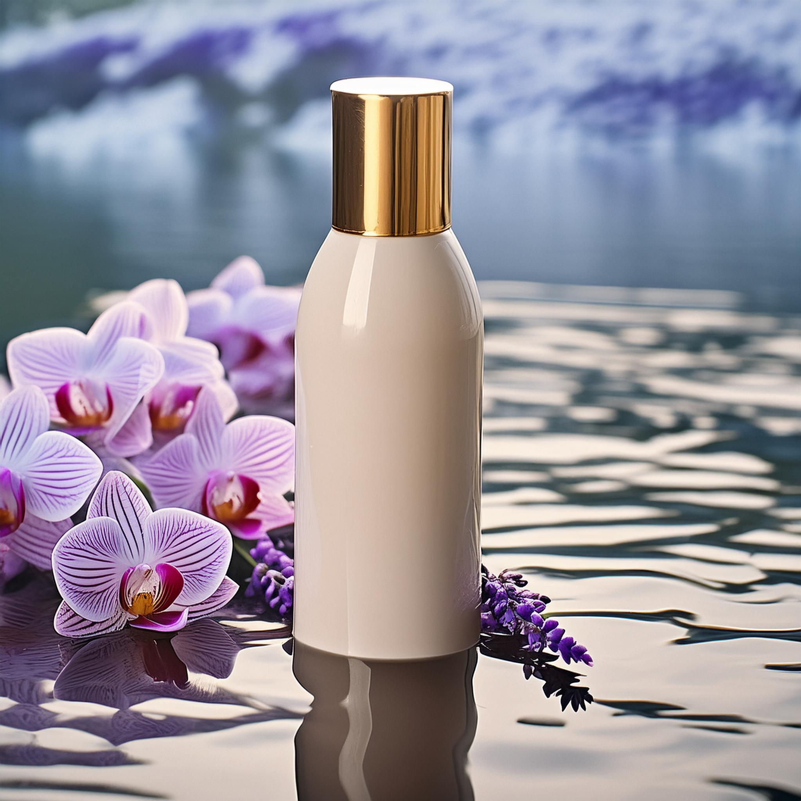

# Write effective prompts

Communicating with the generative AI is essential to working effectively in GenStudio. You can use natural language to articulate your ideas and create new experiences.

The following is a basic text-to-image prompt:

```text
A photograph of a shampoo bottle in the water.
```

{width="300"}

## Descriptive language

Your prompt guides the AI to generate images that complement your vision. The more details that you provide, the greater the chance of producing an image that meets your needs. Use clear and descriptive language to provide as much detail as possible. Use words that describe ambiance, mood, color, composition, and style.

The following prompt builds upon the earlier basic prompt and includes details about the contents of the water:

```text
A health spa photograph of a shampoo bottle in the water, surrounded with floating orchid petals and lavender blossoms.
```

{width="300"}

Continue to experiment with descriptive language and produce variations until an image meets your requirements. The following are examples of detailed prompts:

- "_A serene beach scene at dawn with soft pastel colors, gentle waves, and a clear sky with a few scattered clouds, in a hand-drawn style._"
- "_A bustling cityscape at night with neon lights, tall skyscrapers, and busy streets, in a hyper-realistic style._"
- "_A fantasy forest with towering trees, glowing mushrooms, and mystical creatures, in a vibrant, colorful style._"

## Prompt criteria

In the GenStudio [Create](./create/overview.md) mode, you can use **[!UICONTROL Prompt criteria]** to add details through selection to improve the AI interpretation. You can choose from your company references, such as **[!DNL Brand]** or a specific **[!DNL Persona]** or **[!DNL Product]**, and specify image characteristics, such as aspect ratio.

The following example builds upon the earlier prompt by selecting and applying the **[!DNL Brand]** reference.

{width="300"}

Once you have an image that you like, you have the option of opening Adobe Express to add any last touches or effects.
