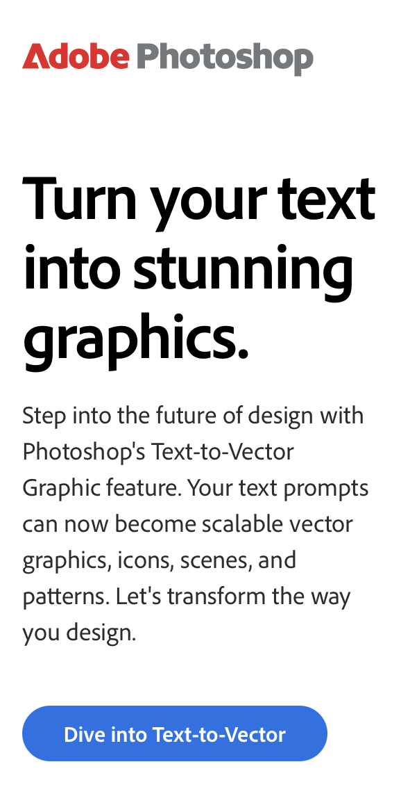

# Write effective prompts

Communicating with the generative AI is essential to working effectively in GenStudio.

GenStudio provides a generative AI prompt each time there is an opportunity to create or modify an asset. You can use natural language to articulate your ideas to create new experiences. The components of an effective prompt include using descriptive language, uploading brand guidelines, providing examples, and restrictions.

## Descriptive language

Your prompt guides the AI to generate images that complement your vision. The more details that you provide, the greater the chance of producing an image that meets your needs. Use clear and descriptive language to provide as much detail as possible. Use words that describe ambiance, mood, color, composition, and style.

For example, the following prompts use descriptive language:

- **Image prompts**

  - _An image of a serene beach scene at dawn with soft pastel colors, gentle waves, and a clear sky with a few scattered clouds, in a hand-drawn style._

  - _A bustling cityscape at night with neon lights, tall skyscrapers, and busy streets, in a hyper-realistic style._

  - _A fantasy forest with towering trees, glowing mushrooms, and mystical creatures, in a vibrant, colorful style._

- **Text prompt**

  ```text
  Write an email that would help users understand the value of the Text-to-Vector Graphics feature. This email should inspire users to experiment with new GenAI features. What is Text-to-Vector Graphic? Text to Vector Graphic is a revolutionary Generative AI feature where you can quickly and more easily create scalable vector graphics with a simple text prompt, including icons, scenes, and patterns. How does Text-to-Vector Graphic work? With a placeholder graphic selected or not, in the Properties panel, taskbar, or Text-to-Vector Graphic panel, select a type, enter a prompt, and generate amazing art! Do not use "generate art" or "create art". Do not use the words "new" and "create" in the same sentence.
  ```

+++See the results of the sample text prompt:

{width="200"}

+++

## Prompt criteria

In the GenStudio [Create](./create/overview.md) mode, you can use **[!UICONTROL Prompt criteria]** to add details through selection to improve the AI interpretation. You can choose from your company references **[!DNL Brand]** or a specific **[!DNL Persona]** or **[!DNL Product]**, and use descriptive language to articulate certain characteristics.

For example, the following text prompt to compose an email:

```text
Write an email to motivate users of Photoshop to follow an in-app tutorial that teaches them to combine elements of two photos into a beautiful work of art. Use references to majestic, natural imagery.
```

The example prompt includes specific Email characteristics:

- **Audience**—users of Photoshop
- **Product**—Photoshop
- **Objective**—teach them how to combine elements from two photos into art
- **Voice and tone**—motivation

>[!BEGINTABS]

>[!TAB Email]

Use a text prompt to generate marketing emails.

Characteristics that influence email composition:

| Email fragments | Brand traits     | Brand information | Campaign information |
| --------------- | ---------------- | ----------------- | -------------------- |
| Preheader       | Voice and tone   | Channel           | Marketing strategy   |
| Headline        | Core values      | Audience          | Objective            |
| Subject         | Frequent keywords | Product          | Key message          |
| Body            | Restrictions     | Concepts          | Themes               |
| CTA (Call to Action) | Unique attributes |||

>[!TAB Image]

Characteristics that influence image composition:

|   | Description |
| -------------- | :---------- |
| **Background** | Set the stage by describing layouts, location, places |
| **Color and tone** |Specify color or color theme, palette, color interpretation and accessibility |
| **Composition** | Define objects, focal point, position, and depth-of-field, framing |
| **Lighting** | Describe how highlights and shadows affect different objects|
| **Restrictions** | List requirements or avoidances |

>[!TAB Social]

Facebook and Instagram...TBD

Characteristics that influence social media composition:

| Site fragments      |
| ------------------- |
| Headline            |
| Body                |
| On-Image Text       |
| CTA (Call to Action) |
| Image               |

>[!ENDTABS]
