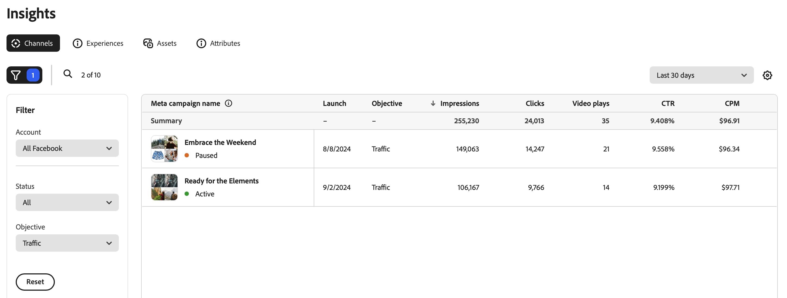

# Channels overview

The [!DNL Insights] _[!UICONTROL Channels]_ view shows a list of campaigns for the connected channel ad account.

>[!TIP]
>
>GenStudio for Performance Marketers requires you to connect to a channel account to begin receiving data. See [Connect channel account](connect-channel.md).

The _[!UICONTROL Channels]_ table is organized using the channel-based ad campaign. Click the settings (cog) icon above the right side of the table to toggle the viewable columns. The filter (funnel) icon above the left side of the table opens the **[!UICONTROL Filter]** menu where you can select from the [!UICONTROL Account], [!UICONTROL Status], and [!UICONTROL Objective] lists to filter the campaigns in the table.

When you select a campaign, the [[!UICONTROL Experiences] tab](experiences.md) opens to a list of ad names associated with that campaign, which allows you to identify which experiences have contributed to its overall success.

## Objectives

At the time that you created a campaign with Meta Ads, you may have selected an objective that aligned with your business goals. There are six objectives from Meta Ads visible in GenStudio for Performance Marketers:

1. **Awareness**: Reach out to the maximum audience and bring awareness to your business.
1. **Traffic**: Increase traffic to your site or application.
1. **Engagement**: Interact with existing and potential customers.
1. **Leads**: Build connections to expand your audience.
1. **App promotion**: Promote your application.
1. **Sales**: Focus on reaching the people mostly likely to use your product.

## Metrics

Depending on your performance goals, Insights metrics can help you evaluate whether you are achieving your objective.

For example, if awareness is your objective, then an increase in the rate of `impressions` may indicate that you are expanding your reach. To understand if that is achieving your objective, you could look at metrics that indicate your content is engaging, such as `clicks` or `video plays`. How effectively is your audience interacting with your content? 

### Metrics detail

The following table provides definitions and insights for key digital marketing metrics in the Channels view. Each metric includes a brief definition as it relates to Channels, how the metric is calculated, and one or more insights to help understand its significance and impact on marketing campaigns.

| Metric      | Definition                    | Insight                          |
| ----------- | ----------------------------- | -------------------------------- |
| **[!UICONTROL Meta campaign name]** | A list of campaign names for the connected channel account. Campaign status can be `Active`, `Paused`, `Deleted`, or `Archived`. Filter campaigns by status and objective. |  |
| **[!UICONTROL Launch]**      | The date that the campaign was released or published to the market. | A high impressions count may indicate that the ad is reaching the intended audience. |
| **[!UICONTROL Impressions]** | Impressions are counted each time content loads on screen, regardless of interaction or viewing. | A high impression count can indicate broad visibility, but for true performance insight, consider with other engagement metrics. |
| **[!UICONTROL Clicks]**      | Number of times users interact with a clickable element, such as a link or a call-to-action button. | A high click count indicates strong interest and engagement with the content, which may be effective and reaching the right audience. |
| **[!UICONTROL CTR]**         | Percentage (%) of users who clicked on an ad, search result, or links. **Calculation**: (`clicks` divided by `impressions`) x 100 = % | A high click-through rate indicates that the content is highly relevant and motivating to the audience in the messaging and design, and is effectively targeting the audience's interests. |
| **[!UICONTROL CPM]**         | Performance measurement for cost ($) for every one thousand ad impressions. **Calculation**: (total amount `spent` divided by `impressions`) x 1000 = $ | A low value may indicate cost-effective visibility, especially when paired with a high click-through rate. |
| **[!UICONTROL CPC]**         | Average cost ($) associated with each click in an experience. **Calculation**: total amount `spent` divided by `clicks` = $ | Lower average costs may indicate cost-efficient ad spend, especially when compared with a rise in conversions. |
| **[!UICONTROL Video plays]** | Percentage (%) of viewers who watched a video to the end. | A high count of video plays may indicate that the video is capturing attention, and can mean that the thumbnail, title, or placement is effectively drawing in viewers. High play completion rates suggest that your video content is compelling and relevant. |
| **[!UICONTROL Budget]**      | Total funds ($) allocated for an ad campaign to achieve campaign goals. | A high budget means more resources for broader reach and potentially greater impact. |
| **[!UICONTROL Spend]**       | The amount ($) spent from the budget over a given period of time to place ads across different platforms. | A high spend amount in a short period may indicate rapid usage, which could lead to early depletion of resources. Track the spend amount against key performance metrics to help monitor the overall return on investment. |
