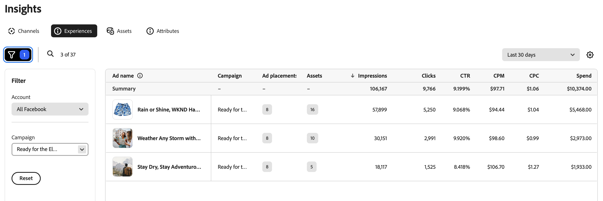

# Experiences overview

The [!DNL Insights] _[!UICONTROL Experiences]_ view shows a list of ads and experiences for the connected channel ad account.

The [!UICONTROL Experiences] table is organized using [!UICONTROL Ad names]. The filter (funnel) icon above the left side of the table opens the **[!UICONTROL Filter]** menu where you can select from the [!UICONTROL Account] and [!UICONTROL Campaign] lists to filter the ad names in the table.

## Ad details

When you select an ad name, you can view the ad performance metrics and attributes, which enable you to analyze an experience's metrics based on its ad placement within a specified date range.

The details view includes a metrics overall ad `click-through rate`, `cost per click`, and how much of the budget has been `spent` on the ad. Since ads can have multiple placements, such as a feed or a banner, you can see a breakdown of the same metrics for each ad placement. Use the left and right arrows under **[!UICONTROL Performance by ad placement]** to cycle through the ad placement metrics.

### Text attributes

Below the Ad preview is a list of [!UICONTROL Text attributes] associated with the ad. When assets and experiences are approved and stored in [!DNL Content], GenStudio for Performance Marketers generates tags based on their inherent features. See [Asset details](../content/asset-details.md#system-metadata) for details about system metadata.

### Ad placements

At the time that you created a campaign with Meta Ads, you may have selected where to run your ads based on the campaign [objective](channels.md#objectives). Ad placements broaden the audience reach for your ad.

GenStudio for Performance Marketers supports ad formats, such as asset feeds, link ads, and single image or video. The following is a list of ad formats by platform:

| Instagram    | Facebook/Meta    | Messenger    | Audience Network |
| --- | --- | --- | --- |
| Explore Explore Home Explore Grid Home Feed Reels Profile Feed Search Shop Stories | Business Explore Feed In-stream video Marketplace Reels Reels Overlay Right-hand column Search Stories Video Feeds Ads on Facebook Reels | Inbox Stories | Native, Banner and Interstitial Native Rewarded Video |

## Metrics

Insights metrics can help you evaluate which experiences contribute to the success of a campaign and which ad placements are most effective.

### Metrics detail

The following table provides definitions and insights for key digital marketing metrics in the [!UICONTROL Experiences] view. Each metric includes a brief definition as it relates to ad names, how the metric is calculated, and one or more insights to help understand its significance and impact on an experience.

| Metric                 | Definition                    | Insight                          |
| ---------------------- | ----------------------------- | -------------------------------- |
| **[!UICONTROL Campaign]**  | A campaign is a set of experiences and ads designed to achieve a specific objective. | |
| **[!UICONTROL Ad placements]** | A count of ad placements for the ad or experience. | Ad placements increase audience reach. |
| **[!UICONTROL Assets]** | A count of assets used in the ad or experience. | |
| **[!UICONTROL Impressions]** | Impressions are counted each time content loads on screen, regardless of interaction or viewing. | A high impression count can indicate broad visibility, but for true performance insight, consider with other engagement metrics. |
| **[!UICONTROL Clicks]**      | Number of times users interact with a clickable element in an ad. Clicks can include clicking a page profile or picture, post reaction, shares, comments, or to expand media to full screen. | A high click count indicates strong interest and engagement with the content, which may be effective and reaching the right audience. |
| **[!UICONTROL CTR]**         | Percentage (%) of users who clicked on an ad. **Calculation**: `clicks` divided by `impressions` | A high click-through rate indicates that the content is highly relevant and motivating to the audience in the messaging and design, and is effectively targeting the audience's interests. |
| **[!UICONTROL CPM]**         | Performance measurement for cost ($) per thousand ad impressions. **Calculation**: total amount `spent` divided by reach, then multiplied by 1000  | A low value may indicate cost-effective visibility, especially when paired with a high click-through rate. |
| **[!UICONTROL CPC]**         | Average cost ($) associated with each click in an experience. **Calculation**: total amount `spent` divided by `clicks` | Lower average costs may indicate cost-efficient ad spend, especially when compared with a rise in conversions. |
| **[!UICONTROL Spend]**       | The amount spent from the budget over a given period of time. | A high spend amount in a short period may indicate rapid usage, which could lead to early depletion of resources. Track the spend amount against key performance metrics to help monitor the overall return on investment. |
