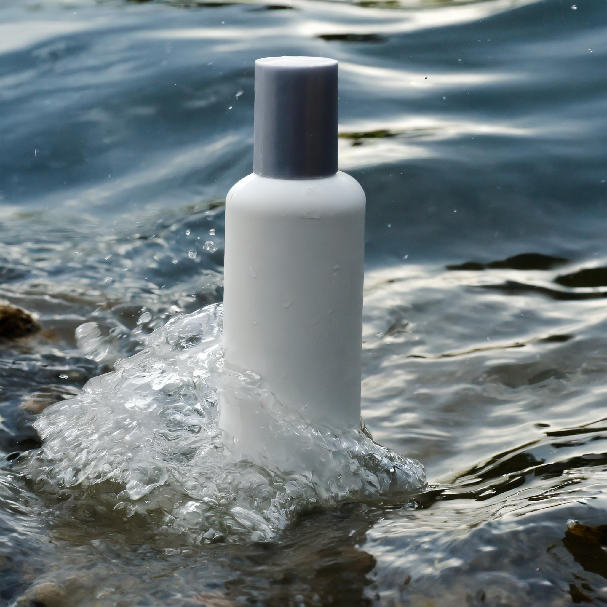
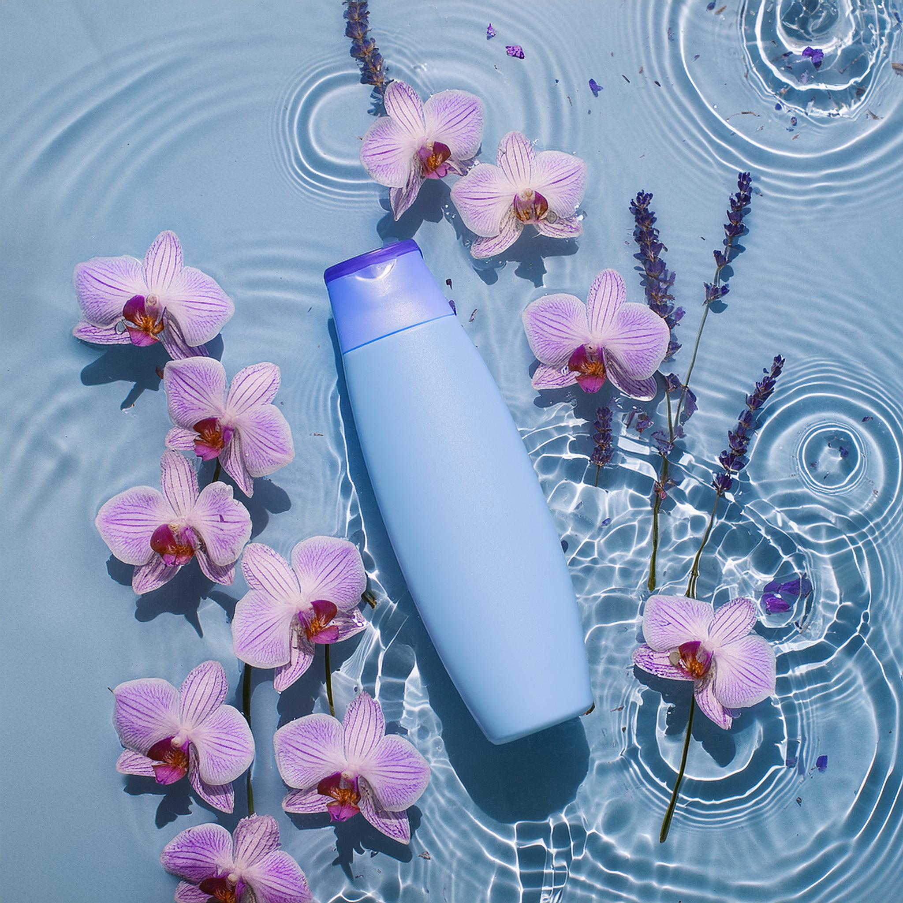

# Write effective prompts

## Image prompts

General advice here...

```text
a photograph of <product> bottle in the water
```



```text
a health spa photograph of <product> bottle in the water, surrounded with floating orchid petals and lavender blossoms
```



## Text prompts

General advice here...
